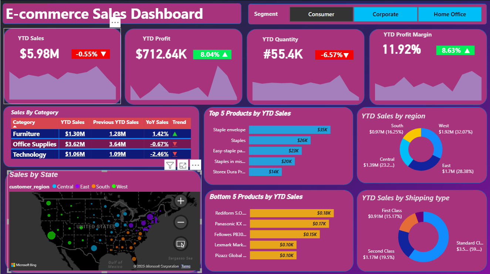
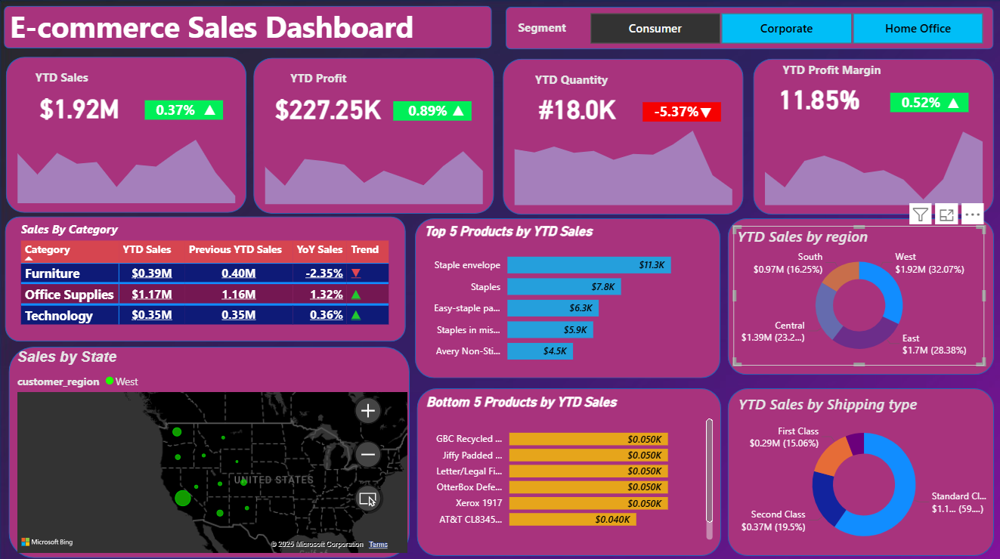
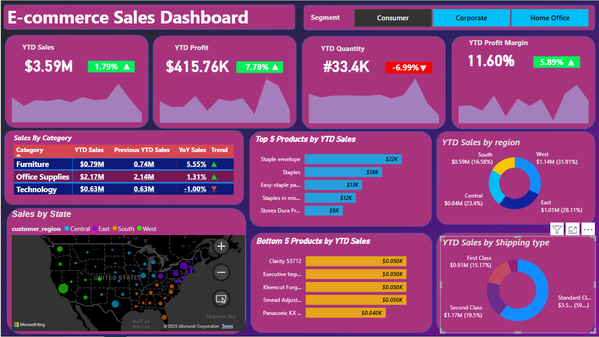

#  E-commerce Sales Power BI Dashboard

This Power BI dashboard provides an in-depth analysis of E-commerce sales, profitability, and customer segments across regions.  
It helps visualize year-to-date (YTD) performance, category-wise trends, and regional sales distribution with dynamic filters.

---

##  Files
- `EcommerceDashboard.pbix` — Power BI project file  
- `1.png`, `2.png`, `3.png` — Dashboard screenshots (different filters and views)

---

##  Dashboard Previews

| Consumer Segment | Corporate Segment | Home Office Segment |
|------------------|-------------------|----------------------|
|  |  |  |

---

##  Key Insights
- **Total YTD Sales:** Up to **$5.98M**, slight **-0.55%** dip overall  
- **YTD Profit:** **$712.64K**, showing **+8.04% growth**  
- **YTD Quantity:** **55.4K units**, down **6.57%**  
- **Top Categories:** Office Supplies and Furniture lead in contribution  
- **West Region:** Dominates with **32.07%** of total sales  
- **Shipping Type:** Standard Class handles **~59%** of total orders  

---

##  Dashboard Highlights
- KPI cards with YoY performance tracking  
- Interactive slicers for **Segment**, **Region**, and **Category**  
- Visual mix: Bar, Pie, and Map charts for deep insights  
- State-level sales visualization with Microsoft Bing Maps  
- Comparison between **Consumer**, **Corporate**, and **Home Office** segments  

---

##  Tools & Skills Used
- **Power BI** — Dashboard development  
- **Excel** — Raw data preparation  
- **DAX** — Calculations for KPIs and YoY growth  
- **Data Modeling** — Relationships and measures setup  

---

##  Author
**Shankar Anil**   
